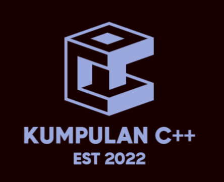

  

<h1 align="center">
  <b>KUMPULAN TUGAS C++</b>
</h1>

# INFORMATION
                       

# PROGRAM BISA DI COMPILE SECARA ONLINE
(https://www.programiz.com/cpp-programming/online-compiler)

> Made with 💕 by [@RioAdityaMukti](https://t.me/xyzcoco).                                      
